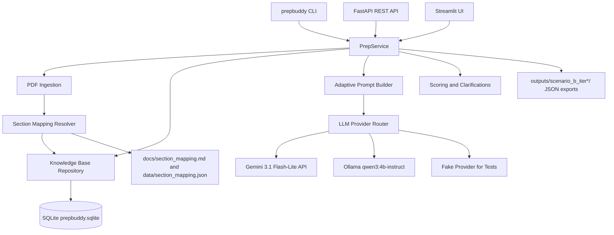

# PrepBuddy: Adaptive PDF Preparation

PrepBuddy is a backend-driven preparation system for machine-readable PDFs. It ingests a library of multi-section documents, lets a user select one PDF and its sections, generates MCQs from those sections, scores answers, persists every session in SQLite, and adapts later question sets toward historically weak topics while avoiding excessive repetition.

The default assessment corpus is `SLATEFALL_DOSSIER.pdf`. The system does not assume the source PDF uses section numbers `1-10`: ingestion assigns canonical reviewer-facing IDs by top-level section order, preserves each source label/title, and writes the resolved mapping to `data/section_mapping.json`, `docs/section_mapping.md`, and per-document mapping files under `data/mappings/` and `docs/mappings/`.

## Architecture



## Stack Choices

- Python 3.12 with a `src/` package layout and a console script so reviewers run `prepbuddy`, not `python -m ...`.
- Typer + Rich for ergonomic CLI commands and readable tables.
- FastAPI for REST endpoints and automatic OpenAPI docs.
- SQLite + SQLAlchemy 2.x for a small, local, queryable KB with simple setup.
- PyMuPDF for fast machine-readable PDF text extraction.
- Gemini 3.1 Flash-Lite as the primary API provider when `GEMINI_API_KEY` is set.
- Ollama `qwen3:4b-instruct` as the local fallback.
- Streamlit for the optional minimal UI.

No vector store is used in v1 because the assessment asks users to select explicit section IDs. SQLite is simpler, faster to set up, and enough for the required adaptive history queries.

## Quick Start in WSL

```bash
cd /mnt/f/prepbuddy
python3 -m venv projectenv
source projectenv/bin/activate
python -m pip install -e ".[dev,ui]"
prepbuddy doctor
```

## Quick Start in Windows PowerShell

```powershell
cd F:\prepbuddy
py -3.12 -m venv venv
.\venv\Scripts\Activate.ps1
python -m pip install --upgrade pip
python -m pip install -e ".[dev,ui]"
prepbuddy doctor --paths
```

If PowerShell blocks activation scripts, run this once in the current shell:

```powershell
Set-ExecutionPolicy -Scope Process -ExecutionPolicy Bypass
.\venv\Scripts\Activate.ps1
```

The Windows console command is installed as `.\venv\Scripts\prepbuddy.exe`, and an activated shell can run it as `prepbuddy`. The UI defaults to non-headless Streamlit mode on Windows, so this opens the browser automatically:

```powershell
prepbuddy ui
```

If a browser cannot be opened by the environment, use `prepbuddy ui --no-open-browser` and open the printed Local URL manually.

Ingest the provided PDF:

```bash
prepbuddy ingest --pdf SLATEFALL_DOSSIER.pdf
prepbuddy sections
prepbuddy map-sections
```

Run the required scenario with a deterministic provider:

```bash
prepbuddy scenario-b --llm fake --questions-per-section 2 --out outputs
```

Run with the configured production provider:

```bash
prepbuddy scenario-b --llm auto --out outputs
```

`auto` uses Gemini when `GEMINI_API_KEY` is configured. Otherwise it uses local Ollama when `qwen3:4b-instruct` is reachable at `PREPBUDDY_OLLAMA_BASE_URL` or `http://localhost:11434`.

Open the UI:

```bash
prepbuddy ui
```

The UI opens on the **Start** view: active documents table, document selector, section mapping, section selector, question count, and the Generate Session button. Generation automatically switches to the **Session** view. The sidebar keeps upload/document controls together, includes a session drawer, provider settings, Gemini API key input, and red confirmation buttons for destructive actions. Gemini keys entered in the sidebar are session-only unless you explicitly check the save option to update `.env`.

## Ollama Local Mode

In WSL:

```bash
ollama serve
ollama pull qwen3:4b-instruct
prepbuddy doctor
prepbuddy prep --sections 5,8 --answers-mode simulate --llm ollama
```

The user already has `qwen3:4b-instruct` downloaded in WSL, so this path should work without another model download.

## Gemini API Mode

Create `.env` from `.env.example` and set:

```bash
GEMINI_API_KEY=...
PREPBUDDY_LLM_PROVIDER=auto
```

Then run:

```bash
prepbuddy scenario-b --llm auto
```

## CLI Reference

```bash
prepbuddy doctor
prepbuddy ingest --pdf SLATEFALL_DOSSIER.pdf
prepbuddy documents
prepbuddy sections
prepbuddy map-sections --document latest
prepbuddy sessions --document latest
prepbuddy prep --document latest --sections 3,7 --questions-per-section 5 --answers-mode interactive --llm auto
prepbuddy scenario-a --document latest --sections 3,7 --out outputs/scenario_a
prepbuddy scenario-b --document latest --out outputs
prepbuddy kb-snapshot --document latest --limit 5
prepbuddy export-kb --document latest --format json --limit 5 --out kb_snapshot.json
prepbuddy delete-session <session_id> --yes
prepbuddy delete-document <document_id> --yes --keep-file
prepbuddy delete-all-documents --yes
prepbuddy delete-all-sessions --yes
prepbuddy clear-knowledge-base --yes
prepbuddy clear-everything --yes
prepbuddy config set-gemini-key --key ...
prepbuddy api --host 127.0.0.1 --port 8000
prepbuddy ui --open-browser
```

`delete-document` archives the selected document and optionally removes its managed upload file. It does not delete sessions or learning history, so uploading the same PDF again reactivates the document with its previous history. `clear-everything` is the hard-delete operation.

`prepbuddy ui` defaults to browser launch on Windows and WSL. If your environment cannot open a browser, run `prepbuddy ui --no-open-browser` and open the Local URL printed by Streamlit, usually `http://localhost:8501`.

## Windows and WSL Paths

The managed upload library lives under `data/uploads/`. Document records store project-local paths where possible and show both Windows-style and WSL-style display paths in the UI and `prepbuddy doctor --paths`. Commands work from either `F:\prepbuddy` in PowerShell with `venv` or `/mnt/f/prepbuddy` in WSL with `projectenv` as long as both environments use the same project directory and database path.

Scenario B writes:

```text
outputs/scenario_b_iter1/questions_iter1.json
outputs/scenario_b_iter1/kb_snapshot_iter1.json
outputs/scenario_b_iter2/questions_iter2.json
outputs/scenario_b_iter2/kb_snapshot_iter2.json
outputs/scenario_b_iter3/questions_iter3.json
outputs/scenario_b_iter3/kb_snapshot_iter3.json
```

## REST API

Start the server:

```bash
prepbuddy api --host 127.0.0.1 --port 8000
```

Open `http://127.0.0.1:8000/docs`.

Endpoints:

- `GET /health`
- `GET /documents`
- `POST /documents/ingest`
- `POST /documents/upload`
- `DELETE /documents`
- `DELETE /documents/{document_id}`
- `GET /sections`
- `GET /sections/mapping`
- `GET /documents/{document_id}/sections`
- `GET /documents/{document_id}/mapping`
- `GET /documents/{document_id}/sessions`
- `POST /sessions`
- `POST /sessions/{session_id}/answers`
- `GET /sessions/{session_id}`
- `DELETE /sessions`
- `DELETE /sessions/{session_id}`
- `GET /history?section_ids=5,8`
- `GET /kb/snapshot?limit=5`
- `DELETE /kb`
- `GET /documents/{document_id}/kb/snapshot?limit=5`
- `DELETE /maintenance/everything`

## Section Mapping

Every document has its own mapping. Every section stores:

- `canonical_id`: internal reviewer-facing ID assigned by document order.
- `source_label`: exact visible label from the PDF.
- `title`: extracted source heading title.
- `aliases`: canonical ID, source label, title slug, and variants.

For the supplied dossier, ingestion maps:

| Canonical ID | Title |
| ---: | --- |
| 1 | Identity, Background, and Public Status |
| 2 | Powers, Abilities, and Documented Limits |
| 3 | Origin and Key Historical Events |
| 4 | Equipment, Gear, and Specialized Technology |
| 5 | Operational Tactics and Combat Doctrine |
| 6 | Allies, Networks, and Known Affiliations |
| 7 | Adversaries and Documented Threats |
| 8 | Known Bases, Safehouses, and Operational Territory |
| 9 | Case Files: Documented Engagements and Incidents |
| 10 | Glossary, Codenames, and Reference Tables |

If a future PDF uses different labels, create `config/section_mapping.json`:

```json
{
  "5": "Operations",
  "8": "Appendix B",
  "9": "Case Studies"
}
```

Scenario commands apply this mapping before resolving sections. If multiple PDFs are ingested, use `--document <id>` or `--document latest` to select the right mapping.

For textbooks, reports, and other PDFs where repeated bullets or references make headings unreliable, ingestion falls back to stable page-range sections such as `Pages 1-27`. This keeps arbitrary machine-readable PDFs usable while preserving direct section detection for dossier-style files and chapter detection for report-style files.

## Knowledge Base

SQLite tables:

- `documents`, `sections`, `section_aliases`, `section_chunks`
- `prep_sessions`, `session_sections`
- `questions`, `answer_choices`, `answers`
- `topic_stats`, `kb_snapshots`, `generation_events`, `app_state`

The KB supports prior-session lookup by document and section IDs, question-level answer history, weak-topic aggregation, and recent session snapshots. Archived documents are hidden from the default document list but retain sections and sessions for reupload history. `clear-knowledge-base` records a reset marker so old sessions stay visible but no longer influence adaptation. CLI and UI snapshots render readable tables; JSON remains available for exports and APIs.

## Tests

```bash
source projectenv/bin/activate
pytest -q
ruff check .
```

Windows:

```powershell
.\venv\Scripts\Activate.ps1
pytest -q
ruff check .
```

The tests cover flexible section parsing, explicit mapping overrides, ambiguous alias handling, session scoring, Scenario B exports/adaptation, Docker config checks, and the API session flow.

## Docker

Docker requires Docker Desktop or another Docker engine on your PATH. In this environment Docker was not installed in Windows or WSL, so Docker build/runtime verification could not be executed here; the Docker files are covered by static tests.

Compose reads `.env` automatically for variable substitution. For Gemini:

```env
GEMINI_API_KEY=...
PREPBUDDY_LLM_PROVIDER=auto
```

Build and run the API:

```bash
docker compose up --build app
```

Open the API docs at `http://localhost:8000/docs`.

Run the Streamlit UI in Docker:

```bash
docker compose --profile ui up --build ui
```

Docker containers cannot reliably open the host browser for you, so open `http://localhost:8501` manually.

Use Ollama running on the host, including Windows or WSL Ollama, with the default compose setting:

```bash
docker compose up --build app
```

Use the containerized Ollama profile instead:

```bash
PREPBUDDY_OLLAMA_BASE_URL=http://ollama:11434 docker compose --profile local-ollama up --build app ollama
docker compose exec ollama ollama pull qwen3:4b-instruct
```

PowerShell equivalent:

```powershell
$env:PREPBUDDY_OLLAMA_BASE_URL = "http://ollama:11434"
docker compose --profile local-ollama up --build app ollama
docker compose exec ollama ollama pull qwen3:4b-instruct
```

The compose file mounts `data/`, `config/`, `outputs/`, `docs/`, and the provided PDFs into the app/UI containers. `.dockerignore` excludes local virtual environments, uploaded runtime PDFs, SQLite files, logs, and outputs from the image build context.

## Known Limitations

- The PDF must contain machine-readable text. Scanned-image OCR is out of scope for this assessment build.
- Local Ollama quality and speed depend on hardware.
- Gemini structured output is the preferred fast path, but the local fallback keeps the project runnable without paid services.
- Section fallback detection is conservative; heavily stylized PDFs may need `config/section_mapping.json`.
