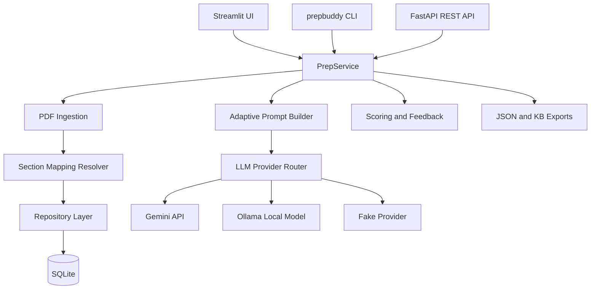

# PrepBuddy

PrepBuddy turns PDFs into adaptive study sessions. Upload a document, choose the sections you want to review, generate grounded multiple-choice questions, answer them, and let the app use your history to focus later sessions on weak topics.

It is designed to stay practical: a local SQLite database, a `prepbuddy` command-line entry point, a FastAPI backend, and a Streamlit UI. You can use Gemini for faster hosted generation, Ollama for local/offline generation, or the deterministic fake provider for demos and tests.

## What It Does

- Manages a library of uploaded PDFs.
- Builds a per-document section map, even when the PDF is a report, book, textbook, or dossier with different heading styles.
- Generates MCQs from selected sections using Gemini, Ollama, or a deterministic local provider.
- Scores sessions and shows clear feedback for correct and wrong answers.
- Preserves document-specific learning history so different PDFs do not pollute each other's adaptive data.
- Archives deleted documents by default, so reuploading the same PDF restores its history.
- Exposes the same core workflow through a browser UI, CLI, and REST API.
- Runs on Windows, WSL/Linux, and Docker.

## Architecture



## Requirements

- Python 3.12 or newer.
- PDFs with extractable text. Scanned PDFs should be OCR'd first.
- Optional: a Gemini API key for hosted inference.
- Optional: Ollama with `qwen3:4b-instruct` for local inference.
- Optional: Docker Desktop or another Docker engine.

## Install on Windows

Open PowerShell:

```powershell
cd F:\prepbuddy
py -3.12 -m venv venv
.\venv\Scripts\Activate.ps1
python -m pip install --upgrade pip
python -m pip install -e ".[dev,ui]"
prepbuddy doctor --paths
```

If PowerShell blocks activation scripts for the current shell session:

```powershell
Set-ExecutionPolicy -Scope Process -ExecutionPolicy Bypass
.\venv\Scripts\Activate.ps1
```

After installation, run commands as `prepbuddy ...`. You do not need to use `python -m`.

## Install on WSL or Linux

```bash
cd /mnt/f/prepbuddy
python3 -m venv projectenv
source projectenv/bin/activate
python -m pip install --upgrade pip
python -m pip install -e ".[dev,ui]"
prepbuddy doctor --paths
```

## Configure Models

PrepBuddy chooses providers in this order when `PREPBUDDY_LLM_PROVIDER=auto`:

1. Gemini, when `GEMINI_API_KEY` is available.
2. Ollama, when the local Ollama server and model are available.

Create a `.env` file from the example:

```bash
cp .env.example .env
```

For Gemini, set:

```text
GEMINI_API_KEY=your-key
PREPBUDDY_LLM_PROVIDER=auto
```

For Ollama:

```bash
ollama serve
ollama pull qwen3:4b-instruct
prepbuddy doctor
```

Provider options:

- `auto`: use Gemini when configured, otherwise use Ollama.
- `gemini`: require Gemini.
- `ollama`: require Ollama.
- `fake`: deterministic generation for tests and demos.

## Quick Start

Ingest a PDF:

```bash
prepbuddy ingest --pdf SLATEFALL_DOSSIER.pdf
prepbuddy documents
prepbuddy sections --document latest
prepbuddy map-sections --document latest
```

Generate and score a simulated session:

```bash
prepbuddy prep --document latest --sections 5,8 --questions-per-section 3 --answers-mode simulate --llm fake
```

Launch the browser UI:

```bash
prepbuddy ui
```

On Windows and desktop Linux, Streamlit should open the browser automatically. In WSL, Docker, or another headless environment, the command still prints a local URL. You can also launch without trying to open a browser:

```bash
prepbuddy ui --no-open-browser
```

## Browser UI

The UI opens on the **Start** view:

1. Review the active document table.
2. Select or upload a PDF.
3. Inspect the section mapping.
4. Choose sections.
5. Set the number of questions per section.
6. Generate a session.

After generation, PrepBuddy switches to the **Session** view. The **Knowledge** view shows readable tables for recent sessions, missed questions, and weak topics.

The sidebar contains:

- PDF upload and document controls.
- Session history for the selected document.
- Provider settings.
- Optional Gemini key entry.
- Maintenance actions such as clearing sessions or resetting adaptive data.

## CLI Reference

```bash
prepbuddy doctor
prepbuddy doctor --paths

prepbuddy ingest --pdf SLATEFALL_DOSSIER.pdf
prepbuddy documents
prepbuddy sections --document latest
prepbuddy map-sections --document latest
prepbuddy sessions --document latest

prepbuddy prep --document latest --sections 3,7 --questions-per-section 5 --answers-mode interactive --llm auto
prepbuddy scenario-a --document latest --sections 3,7 --out outputs/scenario_a
prepbuddy scenario-b --document latest --out outputs

prepbuddy kb-snapshot --document latest --limit 5
prepbuddy export-kb --document latest --format json --limit 5 --out kb_snapshot.json

prepbuddy delete-session <session_id> --yes
prepbuddy delete-document <document_id> --yes --keep-file
prepbuddy delete-all-documents --yes
prepbuddy delete-all-sessions --yes
prepbuddy clear-knowledge-base --yes
prepbuddy clear-everything --yes

prepbuddy config set-gemini-key --key ...
prepbuddy api --host 127.0.0.1 --port 8000
prepbuddy ui --open-browser
```

`delete-document` archives a document by default. Its sessions and learning history remain available, and uploading the same PDF content reactivates the document. `clear-everything` is the full destructive reset.

## REST API

Start the API:

```bash
prepbuddy api --host 127.0.0.1 --port 8000
```

Open the interactive OpenAPI docs at:

```text
http://127.0.0.1:8000/docs
```

Common endpoints:

- `GET /health`
- `GET /documents`
- `POST /documents/ingest`
- `POST /documents/upload`
- `DELETE /documents/{document_id}`
- `GET /documents/{document_id}/sections`
- `GET /documents/{document_id}/mapping`
- `GET /documents/{document_id}/sessions`
- `POST /sessions`
- `POST /sessions/{session_id}/answers`
- `GET /sessions/{session_id}`
- `DELETE /sessions/{session_id}`
- `GET /documents/{document_id}/kb/snapshot`
- `DELETE /kb`
- `DELETE /maintenance/everything`

More examples are in [docs/api.md](docs/api.md).

## Section Mapping

Every document has its own section map. A section stores:

- `canonical_id`: the stable ID used by CLI, API, and UI selectors.
- `source_label`: the label detected in the PDF, such as `Section 5`, `Chapter 2`, or `Pages 28-54`.
- `title`: the detected heading title.
- `aliases`: unambiguous lookup names for section resolution.

PrepBuddy tries explicit section headings first, then chapter-style headings, numeric and Roman numeral headings, and title-like headings. If a book or report has noisy repeated headings, it falls back to page-range sections so the PDF is still usable.

For custom mappings, add `config/section_mapping.json`:

```json
{
  "5": "Operations",
  "8": "Appendix B",
  "9": "Case Studies"
}
```

Generated mapping files are written under `data/mappings/` and `docs/mappings/`.

## Knowledge Base

PrepBuddy stores local state in SQLite through SQLAlchemy. Main tables include:

- `documents`, `sections`, `section_aliases`, `section_chunks`
- `prep_sessions`, `session_sections`
- `questions`, `answer_choices`, `answers`
- `topic_stats`, `kb_snapshots`, `generation_events`, `app_state`

The knowledge base is document-scoped. Adaptive generation uses only the selected document's completed sessions, weak topics, and recent question fingerprints.

See [docs/schema.md](docs/schema.md) and [docs/adaptation.md](docs/adaptation.md) for more detail.

## Docker

Build and run the API:

```bash
docker compose up --build app
```

Open:

```text
http://localhost:8000/docs
```

Run the Streamlit UI:

```bash
docker compose --profile ui up --build ui
```

Open:

```text
http://localhost:8501
```

Use Ollama running on the host:

```bash
docker compose up --build app
```

Use the optional Ollama container:

```bash
PREPBUDDY_OLLAMA_BASE_URL=http://ollama:11434 docker compose --profile local-ollama up --build app ollama
docker compose exec ollama ollama pull qwen3:4b-instruct
```

PowerShell:

```powershell
$env:PREPBUDDY_OLLAMA_BASE_URL = "http://ollama:11434"
docker compose --profile local-ollama up --build app ollama
docker compose exec ollama ollama pull qwen3:4b-instruct
```

The compose file mounts `data/`, `config/`, `outputs/`, and `docs/` so local state survives container rebuilds.

## Testing

WSL or Linux:

```bash
source projectenv/bin/activate
pytest -q
ruff check .
```

Windows:

```powershell
.\venv\Scripts\Activate.ps1
pytest -q
ruff check .
```

The test suite covers PDF parsing, mapping behavior, document history, provider validation and repair, adaptive generation, CLI flows, API flows, UI helpers, and Docker configuration.

## Project Layout

```text
src/prepbuddy/        Application package
tests/                Pytest suite
docs/                 API notes, schema notes, adaptation notes, generated mappings
config/               Optional section mapping overrides
data/                 Local SQLite database, uploads, and generated mapping artifacts
outputs/              Scenario exports and KB snapshots
```

## Limitations

- Scanned PDFs need OCR before ingestion.
- Local generation speed depends on hardware and model size.
- Very noisy PDF layouts may map to page ranges instead of semantic sections.
- The app is local-first and does not include multi-user authentication.
